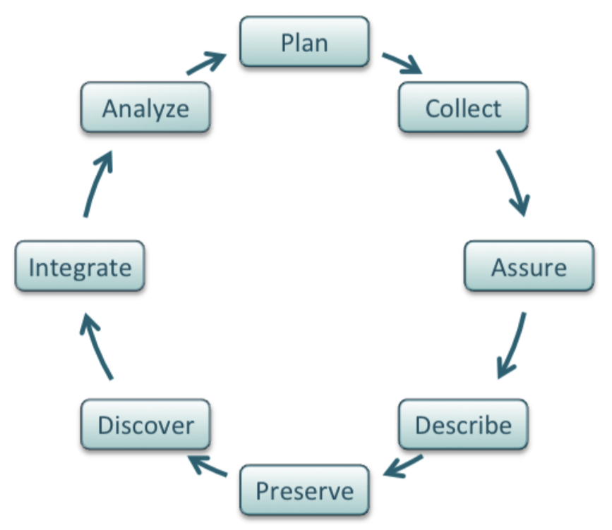

**Topics in this section:**
- [Why publish data?](#why-publish-data)
- [Data management and documentation](#data-management-and-documentation)
  - [Organizing data in spreadsheets](#organizing-data-in-spreadsheets)
  - [Organizing data across a project](#organizing-data-across-a-project)
  - [Documenting data with metadata](#documenting-data-with-metadata)
- [Data repositories](#data-repositories)
  - [Choosing data repositories](#choosing-data-repositories)
  - [Publishing data with Dryad](#publishing-data-with-dryad)
- [Data reuse, ethics, and security](#data-reuse-ethics-and-security)
 
This section provides guidance on improving data management to ease the process of sharing and maximize your research impact,
and also considers options for where to publish your data (e.g., selcting repositories).

## Why publish data?

Curating and documenting data sufficiently for other researchers to use takes time and effort,
and data management competes for attention with other high-priority research activities like generating data in the next experiment.

Given this pressure,
the most straightforward answer to "Why share research data?"
is that a variety of stakeholders require it, including:

- grant funders
- journal publishers
- institutional leadership (university, department, etc)

For example,
the new [NIH Policy on Data Management and Sharing](https://grants.nih.gov/grants/policy/data_sharing/) comes into effect on January 25, 2023,
and many projects are already adjusting their data management practices to accommodate these expectations.

Data sharing is becoming an increasingly frequent expectation because of the need for data to ensure reproducibility of published scientific research.
In addition to improved robustness of scientific findings,
data sharing can also benefit individual researchers
(see [Data sharing and how it can benefit your scientific career](https://www.nature.com/articles/d41586-019-01506-x))
by encouraging collaboration and reuse of existing data,
both of which can accelerate the rate of scientific progress.

The content in this topic is framed around the idea of making data as FAIR as possible:

- **F**indable
- **A**ccessible
- **I**nteroperable
- **R**eusable

For more information on these guiding ideas,
see [The FAIR Guiding Principles for scientific data management and stewardship](ncbi.nlm.nih.gov/pmc/articles/PMC4792175/),
an article describing the principles with examples.

## Data management and documentation

This topic provides general guidance in best practices for organizing and documenting data,
both within a single dataset and across data for an entire project.
Good practices in data management and documentation are essential
for efficient and timely data sharing,
as well as improving workflows across the entire data life cycle.

The [DataONE Best Practices Primer](https://escholarship.org/uc/item/7tf5q7n3),
from which the image above is derived,
describes guidelines for managing data throughout the life cycle of a project.
Additional resources related to overall data management include:
- [Ten Simple Rules for Creating a Good Data Management Plan](https://journals.plos.org/ploscompbiol/article?id=10.1371/journal.pcbi.1004525)
- [Ten Simple Rules for the Care and Feeding of Scientific Data](https://journals.plos.org/ploscompbiol/article?id=10.1371/journal.pcbi.1003542)
- [Research Data Management](https://datamanagement.hms.harvard.edu/) from Harvard University

### Organizing data in spreadsheets

A great deal of scientific data is tabular in nature,
with data organized into rows and columns,
While spreadsheets make it easier for us to view and work with data,
some common spreadsheet practices make it difficult to interpret and reuse the data later.
These resources identify ways to improve the entry and organization of data in this format.

- [Data Organization in Spreadsheets](https://datacarpentry.org/spreadsheet-ecology-lesson/): Data Carpentry lesson demonstrating appropriate practices in data organization. Example data is ecological, but concepts can be applied to any data type.
- [Tidy Data](https://vita.had.co.nz/papers/tidy-data.pdf): paper by Hadley Wickham (developer of R's tidyverse packages) that connects data organization practices with data manipulation for analysis
- [Spreadsheet Help](http://cdluc3.github.io/spreadsheet-help/): collection of additional resources from California Digital Libraries

### Organizing data across a project

Most research projects include multiple data files,
representing different data types and structures.
These data are subsequently filtered and manipulated during analysis,
resulting in an even larger number of diverse files.
The following resources provide a breadth of information for considering data management:

- [Data Organization Best Practices](https://datamanagement.hms.harvard.edu/about-rdmwg): collection of resources from Harvard; includes practical solutions and considerations for all steps in a research project (planning, collecting, analyzing, storing, evaluating, sharing, and accessing)
- [Ten Simple Rules for Digital Data Storage](https://journals.plos.org/ploscompbiol/article?id=10.1371/journal.pcbi.1005097): high-level overview of planning and organization for large-scale datasets

These resources focus on projects including a computational computational component,
and include approaches to support automation of data management:

- [A Quick Guide to Organizing Computational Biology Projects](https://journals.plos.org/ploscompbiol/article?id=10.1371/journal.pcbi.1000424): see [File and directory organization](https://journals.plos.org/ploscompbiol/article?id=10.1371/journal.pcbi.1000424#s3)
- [Good Enough Practices in Scientific Computing](https://journals.plos.org/ploscompbiol/article?id=10.1371/journal.pcbi.1005510): see [Data management](https://journals.plos.org/ploscompbiol/article?id=10.1371/journal.pcbi.1005510#sec004)

### Documenting data with metadata

Metadata refers to information and details about data.
For more information about different types of metadata and it can be used in contexts ranging from social media to museums,
please see [Understanding Metadata: What is Metadata, and What is it For?: A Primer](https://www.niso.org/publications/understanding-metadata-2017).
The resources below will help you think about metadata from the context of scientific research, 
which focuses on providing information about the way data was collected and analyzed
so that other researchers can understand and reuse it.
Remember, though, that documenting your data is as important for yourself (and your collaborators) as for other scientists who may be interested in using it,
and that documentation should occur throughout the research process--
not only when it comes time to publish.

One of the most common tools for recording metadata is with a README,
which is an extra file/document associated with data that describes important information about the dataset and how it was created.
The following resources provide general information about READMEs,
as well as additional guidance on how to document data in different contexts:

-[Guide to writing "readme" style metadata](https://data.research.cornell.edu/content/readme) from Cornell University
- [Ten Simple Rules for Experiments’ Provenance](https://journals.plos.org/ploscompbiol/article?id=10.1371/journal.pcbi.1004384)
- [Ten simple rules on how to write a standard operating procedure](https://journals.plos.org/ploscompbiol/article?id=10.1371/journal.pcbi.1008095)
- [Ten simple rules for annotating sequencing experiments](https://journals.plos.org/ploscompbiol/article?id=10.1371/journal.pcbi.1008260)

## Data repositories

Identifying what data to publish and where to deposit the data can be a daunting task. 
This section identifies types of data repositories
and examples of repositories common in biomedical research.

### Choosing data repositories

There are a variety of different types of data repositories appropriate for depositing and/or archiving biomedical data:

- discipline or topic-specific repositories, like the [National Centralized Repository for Alzheimer's Disease and Related Dementias](https://ncrad.iu.edu/))
- repositories for specific data types, like [NCBI GEO](ncbi.nlm.nih.gov/geo/) and other federally funded data banks
- general data repositories, like institutional repositories and [Dryad](#publishing-data-with-dryad)

For a more comprehensive exploration of biomedical data repositories, 
please see [An overview of biomedical platforms for managing research data](https://link.springer.com/article/10.1007/s42488-020-00040-0)

The table below highlights data repositories that have been recommended by biomedical researchers for particular data types.

| Repository | Data types |
|----|----|
| [cellxgene Data Portal](https://cellxgene.cziscience.com/) | Single cell |
| [Cell Image Library](http://www.cellimagelibrary.org) | image (still, video, z-stack, time series) |
| [Data Dryad](https://datadryad.org/stash) | any (also see [section below](#publishing-data-with-dryad)) |

### Publishing data with Dryad

Dryad is a repository that accepts research data of any type and format.
Please view [the Dryad topic page](/open-science/data_sharing/data_dryad/)
for more information and examples of data submissions.

## Data reuse, ethics, and security

We publish data so that it will be acccessible to other researchers in the future.
The following articles provide some context for associated issues with data reuse,
including data ethics and privacy/security:

- [Six tips for data sharing in the age of the coronavirus](https://www.nature.com/articles/d41586-020-01516-0)
- [Ten simple rules for responsible big data research](https://journals.plos.org/ploscompbiol/article?id=10.1371/journal.pcbi.1005399)
- [Ten Simple Rules to Enable Multi-site Collaborations through Data Sharing](https://journals.plos.org/ploscompbiol/article?id=10.1371/journal.pcbi.1005278)
[Ten Simple Rules for Developing Public Biological Databases](https://journals.plos.org/ploscompbiol/article?id=10.1371/journal.pcbi.1005128)
