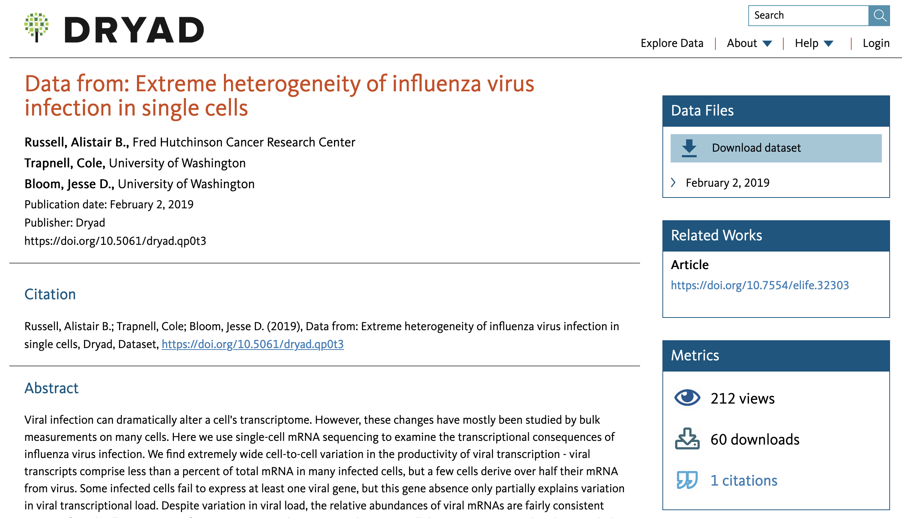
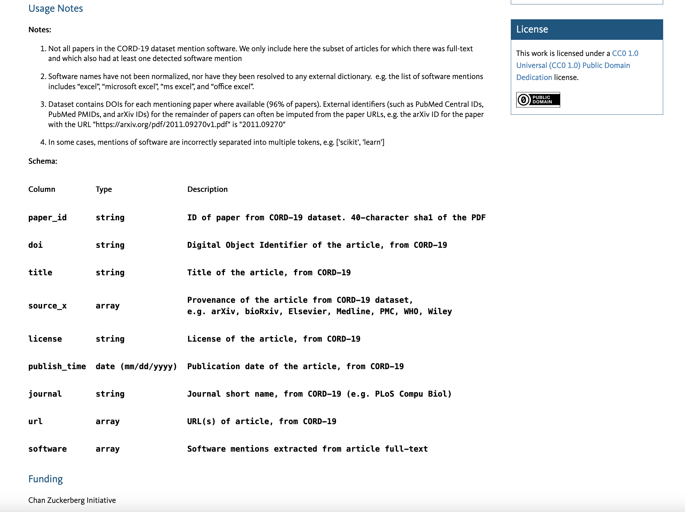
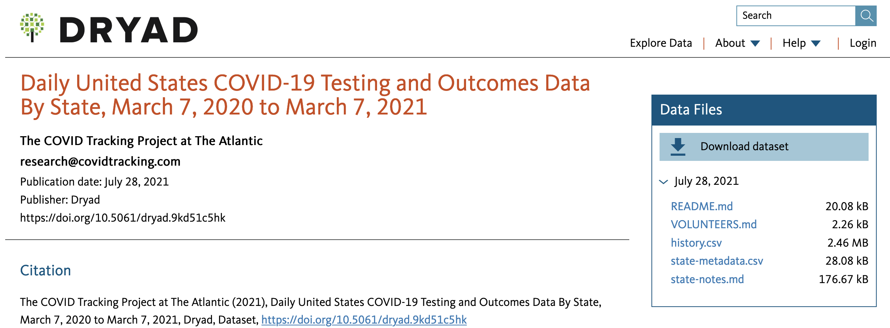
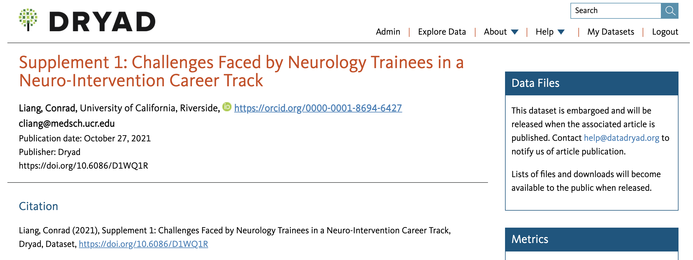
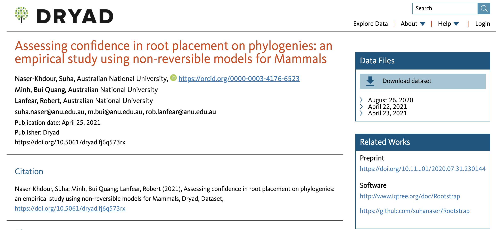

[Dryad](https://datadryad.org/stash) is a digital repository for research data.
The information below describes additional context useful for preparing and submitting biomedical data.

<iframe src="https://fast.wistia.net/embed/iframe/lvtwjcc6z8?seo=false&videoFoam=true" title="Dryad_webinar_Nov2021 Video" allow="autoplay; fullscreen" allowtransparency="true" frameborder="0" scrolling="no" class="wistia_embed" name="wistia_embed" msallowfullscreen width="100%" height="100%"></iframe>

> This 30 minute video includes an overview of material on this page,
> and is also available [on our channel](https://fast.wistia.com/embed/channel/g4orlbms5g?wchannelid=g4orlbms5g&wmediaid=lvtwjcc6z8),
> with the slides available [here](https://docs.google.com/presentation/d/1_uJGBoibC0kNxspiDuQpJAv4l-_XH2vzvk-5R_NFs9A/edit?usp=sharing).

## Who publishes data in Dryad?

 All research data is eligible for publication in Dryad.
 The main reasons researchers publish data in Dryad include:

- The data aren't appropriate to submit to other data- or discipline-specific repositories
- The journal to which a research publication has been submitted belongs to a Publisher Member of Dryad
- The institution (university or research center) sponsoring the research is an Institutional Member of Dryad 

Please view the [complete list of Institutional and Publisher Members](https://datadryad.org/stash/our_membership)
for more information.

> If you are a CZI (Biohub) grantee and are not affiliated with a Dryad member organization,
> you can still publish data entries related to your grant work through Dryad at no cost through the CZI (Biohub) membership.
> See our [grantees page](/open-science/czi-grantees) for more information.

## Benefits of publishing data in Dryad

- **FAIR data:** Dryad supports sharing data according to [Findable, Accessible, Interoperable, and Reusable (FAIR)](https://www.force11.org/group/fairgroup/fairprinciples) principles, which is an expectation of many publishers and funders (including Biohub). Learn more about good data practices on [Dryad's website](https://datadryad.org/stash/best_practices).
- **Flexible data types:** Most data file types can be published through Dryad. Information about the data (metadata) is encouraged at a depth sufficient for future data reuse.
- **DOIs:** Data published through Dryad receives a DOI. A DOI, or Digital Object Identifier, is a unique set of letters and numbers assigned to an item online, such as journal articles, datasets, and software. DOIs allowed the usage of such research deliverables to be tracked over time, helping you understand the impact of your work.
- **Data authorship:** While most data entries in Dryad will have the same authorship as the associated publication, this is not required. Authorship for data entries (and the associated citation) can be independent of the publication, allowing space to include authors that may have only been involved in data collection, or allowing a different order of authorship than the publication, allowing specific credit to be given for data generation and/or curation.
- **Data metrics:** Dryad provides additional metrics about your data, including number of views and downloads.
- **Integrated code publishing:** Code, scripts, and software packages not published elsewhere can be sent directly to Zenodo for publication under your selected license.
- **Links to all parts of a project:** Data entries in Dryad can be linked to all related parts of your project online, including the associated publication (preprint and final peer-reviewed article), software (e.g., GitHub), websites, and data published in other repositories.
- **Private and embargoed data:** Data can be submitted to Dryad privately and made only available to reviewers and/or collaborators. A data entry can also be embargoed (data entry visible, but data unavailable for viewing/download) until the time of publication.  

## Parts of a Dryad data entry

This section describes the general parts of a data entry,
highlighting similarities and differences with publication in a journal,
and identifying features that help your published data have the biggest impact.

> Dryad maintains documentation about their [submission process](https://datadryad.org/stash/submission_process), 
> which describes the steps in publishing an entry:
> uploading data, dataset curation, and dataset publication.

### Data citation

An example of a typical Dryad entry is shown below
(the original entry can be viewed [here](https://datadryad.org/stash/dataset/doi:10.5061/dryad.qp0t3)):

The information at the top of the page shows standard details that would be included in a citation of the data.
This particular entry is associated with a journal publication,
so the title is listed as "Data from:" followed by the title of the original article.
In this case,
the authors are identical to the published article 
(though as noted above, this is not a requirement).
Additional information about the data publication is summarized under the **Citation** subheading.

TODO
> The final section at the bottom of a Dryad data entry is **Funding** for the project.
> If you are a CZI grantee, please remember to acknowledge CZI as a funder,
> as this is important information for us to collect from among Dryad entries!

### Abstract, methods, and data usage

The content below the citation can include a variety of information.
If the data entry is from a publication,
the **Abstract** is generally the same as the manuscript,
though the abstract can be specific to the dataset as well.
The following sections are **Methods** and **Usage Notes**,
which describe how the data were collected/aggregated
and information about using the data, respectively.
One way to maximize the potential for data reuse is to include
enough metadata in these sections such that the data can be 
understood and interpreted.
For example,
the schema (or data dictionary) for [CORD-19 Software Mentions](https://datadryad.org/stash/dataset/doi:10.5061/dryad.vmcvdncs0)
defines each of the columns in the dataset,
so viewers can quickly understand what is represented in the data files:

### Data access

The **Data Files** box on the top right side of the page provides access to the data files.
Clicking "Download dataset" saves a zip file of the entire set of files to your computer.
The date(s) listed in the box represent a version of the data.
(while most data entries have a single date listed,
it is possible to provide updates to the data at a later point in time).
clicking on the arrow next to the date reveals a list of the files in the dataset,
which allows you to access each file individually.
This is especially useful if the [dataset](https://datadryad.org/stash/dataset/doi:10.5061/dryad.9kd51c5hk) contains many files,
or files that are larger than average:

There are occassionally cases in which an author chooses to publish the data under an embargo: 
information about the data entry is published and visible,
though the data files themselves cannot be viewed or downloaded until a specified date.
The image below was taken prior to the October 27, 2021 publication data for [this data entry](https://datadryad.org/stash/dataset/doi:10.6086/D1WQ1R),
and demonstrates how an embargoed entry appears:

Additionally, a data entry can be submitted to Dryad under the ["Private for Peer Review"](https://datadryad.org/stash/faq#ppr) feature.
This means the dataset is kept private (not published publicly),
although the files can still be shared with journals (reviewers and editors)
and collaborators via a private URL.

Additional boxes on the right side include:
 
- **Metrics**: number of views, downloads, and citations for the dataset
- **Keywords**: often the same as the associated publication; it may be useful to adjust them for the data entry, as this can improve discoverability for reuse

### Related works

The **Related Works** box on the right side of the page include links to other websites relevant to the data.
Often this is a single link which points to the published journal publication associated with the data, and is labeled as "Article".

The following [data entry](https://datadryad.org/stash/dataset/doi:10.5061/dryad.fj6q573rx) features two additional categories for "Related Works":

- "Preprint" is a link to the posted preprint in bioRxiv
- "Software" includes links to the project's software documentation website, as well as source code in GitHub

The final manuscript can be also listed as "Article" upon publication.

For data entries that are not formally linked to a single publication,
the links may be listed as "Supplemental Information,"
such as in [this entry](https://datadryad.org/stash/dataset/doi:10.5061/dryad.9kd51c5hk) for the [COVID Tracking Project](https://covidtracking.com/).

## Example Dryad data entries

The table below includes examples of Dryad data entries associated with biomedical research publications.
These are shared to represent the breadth of data and file types published in Dryad.

| Citation | Data type |
|---|---|
| Russell, Alistair B.; Trapnell, Cole; Bloom, Jesse D. (2019), Data from: Extreme heterogeneity of influenza virus infection in single cells, Dryad, Dataset, [https://doi.org/10.5061/dryad.qp0t3](https://doi.org/10.5061/dryad.qp0t3) | annotated cell-gene matrix for the single-cell mRNA sequencing |
| Moffitt, Jeffrey R. et al. (2018), Data from: Molecular, spatial and functional single-cell profiling of the hypothalamic preoptic region, Dryad, Dataset, [https://doi.org/10.5061/dryad.8t8s248](https://doi.org/10.5061/dryad.8t8s248) | csv with measured properties of cells |
| Chauhan, Ganesh et al. (2019), Data from: Genetic and lifestyle risk factors for MRI-defined brain infarcts in a population-based setting, Dryad, Dataset, [https://doi.org/10.5061/dryad.hk07677](https://doi.org/10.5061/dryad.hk07677) | methods, supplemental tables/figures, references |
| Hobson, Brad A. et al. (2019), Data from: TSPO PET Using [18F]PBR111 reveals persistent neuroinflammation following acute diisopropylfluorophosphate intoxication in the rat, Dryad, Dataset, [https://doi.org/10.5061/dryad.7c7b561](https://doi.org/10.5061/dryad.7c7b561) | MRI and positron emission tomography (PET) scans |
| Sampson, Timothy R. et al. (2017), Data from: Gut microbiota regulate motor deficits and neuroinflammation in a model of Parkinson’s disease, Dryad, Dataset, [https://doi.org/10.5061/dryad.4mp6h](https://doi.org/10.5061/dryad.4mp6h) | xlsx files with motor function scores and cellular measurements |
| Gonzalez-Hunt, Claudia P. et al. (2015), Data from: Exposure to mitochondrial genotoxins and dopaminergic neurodegeneration in Caenorhabditis elegans, Dryad, Dataset, [https://doi.org/10.5061/dryad.dd84g](https://doi.org/10.5061/dryad.dd84g) | supplemental figures and tables |
| Nández, Ramiro et al. (2015), Data from: A role of OCRL in clathrin-coated pit fission and uncoating revealed by studies of Lowe syndrome cells, Dryad, Dataset, [https://doi.org/10.5061/dryad.n5p7g](https://doi.org/10.5061/dryad.n5p7g) | xlsx files of quantitative proteomics results |
| Schwarz, Niklas et al. (2019), Data from: Long-term adult human brain slice cultures as a model system to study human CNS circuitry and disease, Dryad, Dataset, [https://doi.org/10.5061/dryad.s5g2712](https://doi.org/10.5061/dryad.s5g2712) | images used to create 3D reconstructions, xlsx files with measurements of cells | 
